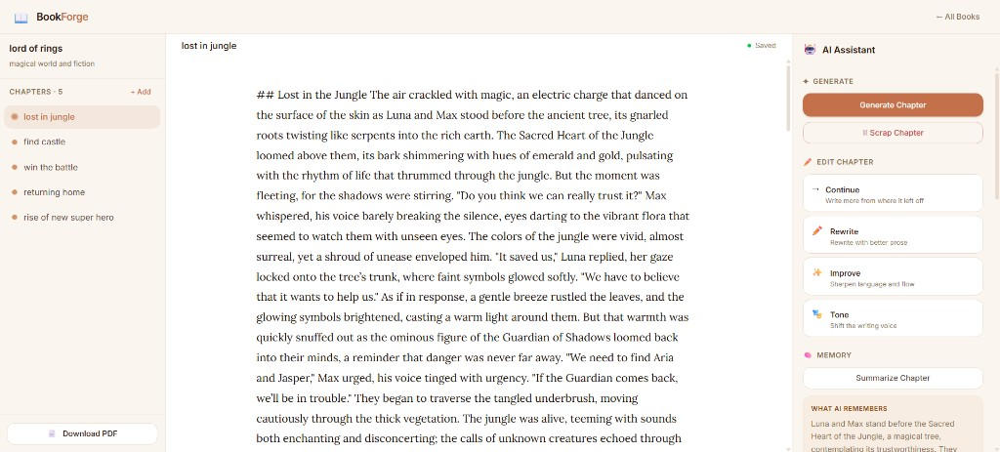
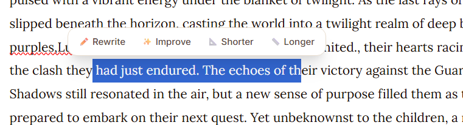

# AI Book Editor

<p align="center">
  <br />
  <br />
  
</p>

A writing app for **long-form fiction**: the AI plans outlines, drafts chapters with streaming, and keeps a **compressed memory** of the whole book so later chapters stay coherent—even when the full manuscript would not fit in one prompt.

---

## Tech stack

| Layer | Stack |
|-------|-------|
| Frontend | React 18, Vite, TipTap v2, Zustand, Tailwind CSS |
| Backend | Python 3.11, FastAPI, SQLAlchemy, SQLite, Alemb ic |
| AI | OpenAI (default `gpt-4o-mini` via env), local model Ollama fallback |

---

## Quick start

### Backend

```bash
cd backend
python -m venv .venv
.venv\Scripts\activate          # Windows
# source .venv/bin/activate     # macOS / Linux
pip install -r requirements.txt
cp .env.example .env            # add OPENAI_API_KEY (optional if using Ollama)
alembic upgrade head
uvicorn main:app --reload
```

- API: http://localhost:8000  
- Interactive docs: http://localhost:8000/docs  

### Frontend

```bash
cd frontend
npm install
npm run dev
```

- App: http://localhost:5173

---

### Tests

```bash
cd backend
pip install -r requirements.txt
python -m pytest tests -v
```  
---

## Demo / walkthrough
# Loom vidoe

https://www.loom.com/share/d0fdff2d0a824f5385a6fdbe8c362055

---

## What you can do

- Create books (title, genre, brief) and **generate an AI outline** (chapters with titles + briefs).
- Open a chapter, **generate or edit** prose in a rich-text editor; changes **auto-save** after a short debounce.
- Use the AI panel: generate chapter (SSE), rewrite / improve / continue / tone, summarize, scrap draft, view **chapter + book memory** summaries.
- **Export** the book as PDF.

---

## Architecture (high level)

Feature-based **modular monolith**: each area owns routes, services, models, and schemas.

```
backend/
├── features/book/     # CRUD, PDF export
├── features/chapter/  # CRUD, reorder
├── features/ai/       # agents, LLM client, orchestration
├── memory/            # context builder + summary persistence
├── prompts/           # prompt templates per agent
└── middleware/        # error handling

frontend/src/
├── app/store/         # Zustand (books + editor)
├── features/book|chapter|ai/
└── components/        # TipTap editor, UI (toasts, etc.)
```

**Agents:** planner (outline JSON), writer (streaming chapter), summarizer (chapter + rolling global summary), editor (rewrite-style actions). They do not talk to HTTP or the DB directly; a **service layer** wires them to persistence and audit logs (`ai_actions`).

---

## API reference

| Method | Path | Description |
|--------|------|-------------|
| POST | `/api/books/` | Create book |
| GET | `/api/books/` | List books |
| GET | `/api/books/{id}` | Book + chapter list |
| PUT | `/api/books/{id}` | Update metadata |
| DELETE | `/api/books/{id}` | Delete book (cascade) |
| POST | `/api/books/{id}/chapters` | Add chapter |
| GET | `/api/books/{id}/chapters` | List chapters |
| GET | `/api/chapters/{id}` | Get chapter |
| PUT | `/api/chapters/{id}` | Update content |
| DELETE | `/api/chapters/{id}` | Delete chapter |
| PATCH | `/api/chapters/{id}/reorder` | Reorder |
| POST | `/api/ai/outline` | Generate outline |
| POST | `/api/ai/generate-chapter` | Stream chapter (SSE) |
| POST | `/api/ai/rewrite` | Edit actions on text |
| POST | `/api/ai/summarize` | Summarize chapter |
| GET | `/api/chapters/{id}/history` | AI action history |
| GET | `/api/books/{id}/export/pdf` | Download PDF |

---

## Bonus questions

*Short answers required for the assignment; implementation details live in `memory/context_builder.py` and `features/ai/`.*

### 1. How does your system preserve context across a long book?

After each generated chapter, the pipeline saves the text, produces a **~150-word chapter summary** using llm (we can use small local models for this in future and for generation we can use main models for cost saving), and updates a **rolling global summary** (~200 words) for the whole story so far. For the **next** generation, a **context builder** sends: book metadata and brief, the global summary, **all other chapters’ summaries** (not full text), the **full text of only the immediately previous chapter**, and the current chapter’s title/brief (and any user draft). That keeps prompt size **roughly bounded**—chapter 30 costs about as much context as chapter 3 in terms of design, instead of pasting the entire book.

**Future-scope**- we can use RAG after users increases >10k. 

### 2. How do you prevent the AI from losing consistency over time?

Three levers: **(1)** the global summary gives a story-wide anchor; **(2)** the previous chapter in full preserves context, pacing, and what just happened; **(3)** per-chapter **briefs** from the outline keep each chapter aimed at a defined beat. Summaries can still drop minor details (e.g. a small character from an early chapter); a stronger fix would be structured **entity memory or graph**-characters, places, open threads, updated with summaries..

### 3. Why did you choose your architecture?

**FastAPI** fits async, streaming (SSE), and clear OpenAPI docs. **SQLite** is zero-config for a prototype; the stack is easy to point at Postgres later. **React + TipTap** gives a real document model and programmatic updates for streaming. Splitting **planner / writer / summarizer / editor** keeps prompts and failure modes separate; the **service layer** owns orchestration and DB writes so agents stay testable in isolation.

### 4. What would you improve with more time?

- **Entity memory** — characters, places, open threads, updated with summaries.  
- **Diff UI** for AI rewrites (side-by-side or inline), not only accept/reject blocks.  
- **DOCX export** alongside PDF.  
- **Broader automated tests** (including mocked or contract tests for LLM routes) and optional **E2E** against a running stack.  
- **Collaboration** (e.g. Yjs + TipTap) if the product moves beyond single-user.

### 5. Where did AI tools help you, and where did you rely fully on your own implementation?

**AI coding tools** (e.g. Cursor, claude, chatgpt) sped up boilerplate, scaffolding, and repetitive CRUD; **the product’s** LLM powers outlines, generation, summarization, and edits. **My own work** includes the **memory and context design** (what to compress vs. send in full), **agent boundaries**, **prompt intent and structure**, **streaming + finalize pipeline**, integration debugging, and validation of behavior end-to-end.

For a **transparent, line-by-line** breakdown of what was AI-assisted vs. hand-written, see **[AI_USAGE.md](AI_USAGE.md)**.

---

## Assumptions and tradeoffs

| Choice | Rationale |
|--------|-----------|
| SQLite | Simple local dev; schema ports to Postgres with config change. |
| Configurable OpenAI model | Cost/quality tradeoff via env; Ollama path when API is unavailable. |
| No auth | Single-user prototype scope. |
| No list pagination | Fine for demo-scale libraries. |
| Debounced auto-save | Fewer “lost work” incidents; power users could get an explicit-save toggle later. |

---

## Deploying on AWS (future)

Using only **EC2**, **S3**, and **RDS**:

**S3 — frontend**  
- Run `npm run build` in `frontend` and upload the contents of `dist/` to a bucket.  
- Turn on **static website hosting** (or serve the bucket behind your usual HTTPS setup).  
- Build the app with `VITE_API_BASE_URL` set to your **public API URL** (the EC2 address or domain you expose for FastAPI), not `http://localhost:8000`.

**RDS — database**  
- Create an **RDS for PostgreSQL** instance in the same VPC (or a reachable network) as your app.  
- Point SQLAlchemy at the RDS endpoint with Alembic migrations; keep credentials in env vars or a restricted file on the server—not in Git.

**EC2 — backend + nginx**  
- Launch an EC2 instance (Amazon Linux or Ubuntu), install Python 3.11+, clone the repo, set up a venv, `pip install -r requirements.txt`, run Alembic migrations against RDS.  
- Run **uvicorn** bound to localhost only, e.g. `uvicorn main:app --host 127.0.0.1 --port 8000` (use **systemd** so it restarts on reboot).  
- Install **nginx** and terminate **HTTPS** on port 443 (TLS certs via ACM + a load balancer, or **Let’s Encrypt** on the instance). Nginx **reverse-proxies** all API traffic to uvicorn:

```nginx
server {
    listen 443 ssl;
    server_name api.yourdomain.com;
    # ssl_certificate / ssl_certificate_key paths here

    location / {
        proxy_pass http://127.0.0.1:8000;
        proxy_http_version 1.1;
        proxy_set_header Host $host;
        proxy_set_header X-Real-IP $remote_addr;
        proxy_set_header X-Forwarded-For $proxy_add_x_forwarded_for;
        proxy_set_header X-Forwarded-Proto $scheme;
        proxy_buffering off;   # helps SSE/streaming AI responses
    }
}
```

- Security group: **443** (and **80** if you redirect HTTP→HTTPS) from the internet; **RDS** only from this instance’s security group.  
- Store **`OPENAI_API_KEY`** and the DB URL in the instance environment or a protected `.env` on the box—not in Git.  
- Point **`VITE_API_BASE_URL`** at your public API URL, e.g. `https://api.yourdomain.com`.

**CORS**  
- Configure FastAPI to allow your **S3 website origin** (or the domain you use in front of it) so the browser can call the nginx/EC2 API.

---

## License

MIT — see [LICENSE](LICENSE).
